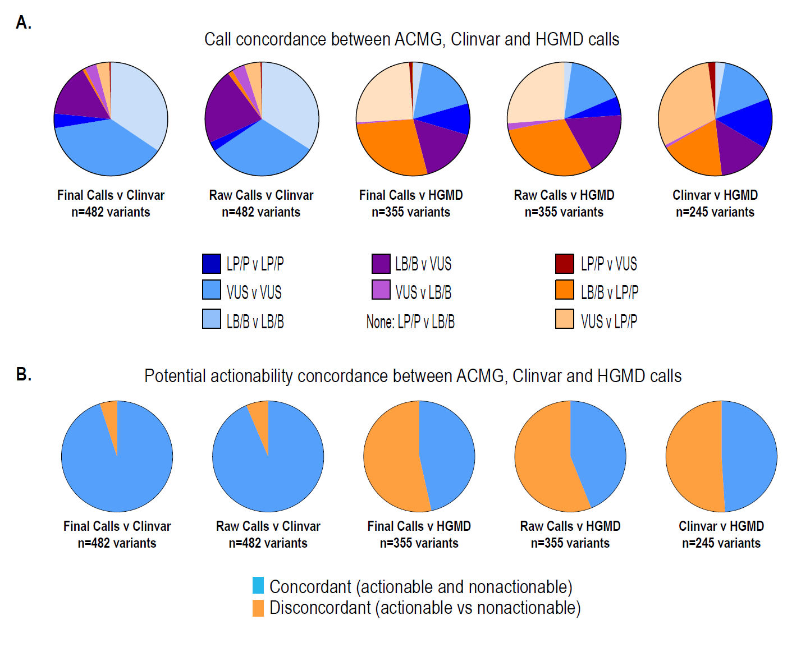

```{r, load_refs, include=FALSE, cache=FALSE}
library(RefManageR)
library(citr)
BibOptions(check.entries = FALSE,
           bib.style = "numeric",
           cite.style = "numeric",
           hyperlink = FALSE,
           dashed = FALSE,
           first.inits = TRUE,
           no.print.fields = c("doi", "url", "isbn", "urldate"))
myBib <- ReadBib("./ACMG.bib", check = FALSE)
```

# Question  

* Can our lab classify novel missense variant into pathogenic or benign, not VUS?  
---
# Standards and Guidelines for the Interpretation of Sequence Variants

* To describe variants identified in Mendelian disorders  
* American College of Medical Genetics and Genomics (ACMG) `r Citep(myBib, "richards_2015_standards_genetmeda")`  
* ENIGMA BRCA1/2 Gene Variant Classification Criteria  
* International Agency for Research on Cancer (IARC)  

---
# Why is BRCA1/2 special?  

* High prevalence in population  
* Frequent benign variant  

---
# What about hereditary breast and ovarian cancer syndrome (HBOCS)  

* BRCA1/2 and other genes  
* Breast, ovarian cancer and other cancers  
* Prevalence (between 1 in 400 to 1 in 800 people)
* Penetration rate (40-90%)  

---
# Categories of interpretation of variants

* Pathogenic  
* Likely-pathogenic  
* Uncertain (VUS)  
* Likely-benign  
* Benign  

---
# Let's guess the evidences  

---
# Famly pedigree


---
# Segregation data (BS1, PP1)  

* Caveat: linkage disequilibrium  
* Penetration rate  
* Difficult statistical evaluation  

---
# Population data


---
# Population data  

* 5%: benign stand alone (BA1)  
* 0.5-5% (BS1)  
* Wow! The first time observed variant! (Absent in population DB, PM2)  

---
# Null variant  

* Frameshift, Nonsense, canonical +-1 or 2 splicing site, initiation codon
* Caveat: LOF variants at the extreme 3′ end of a gene  
* Caveat: presence of multiple transcripts  

---
# Computational (in silico) data  

* PolyPhen2, SIFT, MutationTaster, etc  
* Mutational hot spot and/or critical and wellestablished (PM1)  
* Protein length changes due to in-frame deletions/insertions and stop losses functional domain (PM4 BP3)  
* Novel missense at the same position (PM5)

---
# Other evidence  

* de novo variants (PS2 PM6)
* Functional studies (PS3 BS3)
* Allelic data (BP2 PM3)  

---
# Evidences of interpretation

* Population data  
* Computational data  
* Functional data  
* Segregation data  
* De novo data  
* Allele data  
* Other databases  
* Other data  

---
# 27 variant attributes


---
# Rules for combining criteria to classify sequence variants


---
### Evaluation of ACMG-Guideline-Based Variant Classification of Cancer Susceptibility and Non-Cancer-Associated Genes in Families Affected by Breast Cancer`r Citep(myBib, "maxwell_2016_evaluation_theamericanjournalofhumangenetics")`

* Whole-exome sequencing  
* 180 medically relevant genes
* 404 individuals  
* 253 families
* 1,640 variants

```{r cmc, eval=FALSE, echo=FALSE}
library(readr)
library(tidyverse)
library(stringr)
acmg <- read_csv("acmg.csv")
cmc <- read_csv("BRCA_cmc.csv")
brca <- acmg %>%
  filter(SNPEFF_Gene_name == "BRCA1" | SNPEFF_Gene_name == "BRCA2")
brca$protein <- gsub("/", '', str_extract(brca$SNPEFF_Amino_acid_change, "p.*/"))

cmc$X2[cmc$X2 %in% brca$protein]


```


---
# Example (VUS)  

* 76/M, Lung adenocarcinoma  
* NM_000059.3(BRCA2):c.5683G>A (p.Glu1895Lys)

---
# Which evidences among 27 variants attributes are available in our lab?
[Ion torrent](https://junkang.netlify.com/slide/ACMG_standards_and_guidelines/Ion Reporter _ Thermo Fisher Scientific.html)

---
class: small-font
# Characteristics of BRCA1/2  

* LOF known mechanism of disease (for PVS1)  
* Mode of inheritance (for PM3/BP2)
  * AD/AR (BRCA2)
* Missense pathogenic (for PP2/BP1)  
  * BRCA2 1%  
* Hot spot or critical/well-established functional domain (for PM1)
  * BRCA2, Helical (2479-2667), OB (2670-2799 and 3052-3190), Tower (2831-2872)  

---
class: small-font
# NM_000059.3(BRCA2):c.5683G>A (p.Glu1895Lys)

* LOF known mechanism of disease (for PVS1)  
* Mode of inheritance (for PM3/BP2)
  * AD/AR (BRCA2)
* Missense pathogenic (for PP2/**BP1**)  
  * **BRCA2 1%**  
* Hot spot or critical/well-established functional domain (for PM1)
  * BRCA2, Helical (2479-2667), OB (2670-2799 and 3052-3190), Tower (2831-2872)  

---
# Characteristics of varant (NM_000059.3(BRCA2):c.5683G>A (p.Glu1895Lys))  

* ClinVar (Uncertain significance (Last evaluated: Nov 1, 2015)) (PP5, BP6)
* Population AF: $8.29e^{-06}$ (PM2, BA1, BS1)
* Insilico SIFT 1.0, phyloP -0.72, PolyPhen-2 0.004 **BP4**  

---
# Functional assay (BS3)

* Findlay (2018) Nature 562: 217 PubMed: 30209399
* Guidugli (2013) Cancer Res 73: 265 PubMed: 23108138  
* Biswas (2011) Blood 118: 2430 PubMed: 21719596  
* Becker (2012) Breast Cancer Res Treat 135: 167 PubMed: 22729890   

---
# Summary  

* **Likely benign** 
* $\ge$ 2 supporting (**BP1**, **BP4**)

---
# In Maxwell study `r Citep(myBib, "maxwell_2016_evaluation_theamericanjournalofhumangenetics")`  

  

---
# Korean founder mutation BRCA1 p.Leu1780Pro `r Citep(myBib, "park_2017_identification_cancerrestreat")`  

* 745 HBOC patients  
* 86 VUS
* 64 missense

---
# Korean founder mutation BRCA1 p.Leu1780Pro `r Citep(myBib, "park_2017_identification_cancerrestreat")`  

* BRCA1	NM_007294.3:c.5339T>C	Leu1780Pro
* No of patients: 11
* PS4: Odds ratio by Korean 41.2 (2.4-699.5)
* PS3: Functional study 
* PP3: In silico test
* BP1: Missense	


---
# Question  

* Can our lab classify novel missense variant into pathogenic or benign, not VUS?  
# Answer  

* Yes, we can but...

---
# Unrobust result  

* BP4 (How many in silico test)  

---
# HBOC cohort

---
class: my-one-page-font

# Experience  

>This sequence change replaces glutamic acid with lysine at codon 1895 of the BRCA2 protein (p.Glu1895Lys). The glutamic acid residue is weakly conserved and there is a small physicochemical difference between glutamic acid and lysine. This variant is present in population databases (rs146351301, ExAC 0.009%). This variant has been reported in individuals affected with breast cancer (PMID: 25682074, 20104584, 27257965, 28664449). In the literature, this variant is also known as 5911G>A. ClinVar contains an entry for this variant (Variation ID: 142307). Algorithms developed to predict the effect of missense changes on protein structure and function output the following: SIFT: "Tolerated"; PolyPhen-2: "Benign"; Align-GVGD: "Class C0". The lysine amino acid residue is found in multiple mammalian species, suggesting that this missense change does not adversely affect protein function. These predictions have not been confirmed by published functional studies and their clinical significance is uncertain. In summary, the available evidence is currently insufficient to determine the role of this variant in disease. Therefore, it has been classified as a Variant of Uncertain Significance.

`r tufte::quote_footer('Sherloc Invitae')`

---
# Sherloc: a comprehensive refinement of the ACMG–AMP variant classification criteria `r Citep(myBib, "nykamp_2017_sherloc_genetmed")`

* Iterative refinement of ACMG guideline
* 33 ACMG criteria to 108 criteria
* Combination of evidence to semiquantitative system

---
# Challenges and Considerations in Sequence Variant Interpretation for Mendelian Disorders `r Citep(myBib, "kim_2019_challenges_annlabmed")`

---
# CMC pathology lab

* In house database  
* https://brcaexchange.org/
* http://coda.nih.go.kr/coda/KRGDB/ 
* https://www.ncbi.nlm.nih.gov/clinvar/
* https://gnomad.broadinstitute.org/

---
# BRCA2 c.10150C>T p.Arf3384Ter

---
# KOBRA `r Citep(myBib, "kang_2015_prevalence_breastcancerrestreat")`


---
# End truncation


---
# HUMAN MUTATION Mutation in Brief 31: E 1200-E1240 (2010) Online

Finally, three sequence variants – BRCA2 c.9976A>T (BIC: K3326X), c.10095delCins11 (BIC: 10323delCins11) and c.10150C>T (BIC: **R3384X**) predicted to result in protein truncation were ruled as exceptions that **could not be classified** because of their **location near the 3´-end** and possibly dispensable part of the gene.

---
# Clinvar

BRCA2 c.9976A>T (p.Lys3326*) variant, located upstream of this variant and also in the last exon of the gene, is a known benign variant.

---
# Conclusions

* ACMG guideline  
* Systemaic review system is requred  
* Let's determine VUS to benign or even pathogenic    

---
class: my-one-page-font 
# References

```{r refs, echo=FALSE, results="asis"}
PrintBibliography(myBib)
```

<style type="text/css">
.remark-slide-content {
    font-size: 32px;
    padding: 1em 4em 1em 4em;
}
.small-font {
  font-size: 28px;
}
.xsmall-font {
  font-size: 22px;
}
.my-one-page-font {
  font-size: 18px;
}
 {
    max-width: 100%;
}
</style>

