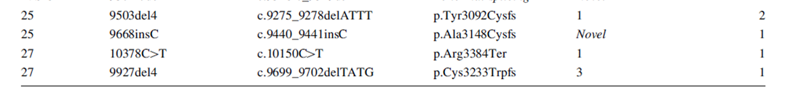

ACMG Standards and guidelines for interpretation of sequence variants
========================================================
author: Jun Kang
date: 2019.09.25
autosize: true

Interpretation of variants
========================================================
* Pathogenic  
* Likely-pathogenic  
* Uncertain (VUS)  
* Likely-benign  
* Benign  

Standards and Guidelines for the Interpretation of Sequence Variants
========================================================
* To describe variants identified in **Mendelian disorders**  
* ENIGMA BRCA1/2 Gene Variant Classification Criteria
* **American College of Medical Genetics and Genomics (ACMG)**
* International Agency for Research on Cancer (IARC)

ACMG Standards and guidelines for interpretation of sequence variants
========================================================

Population, disease-specific, and sequence databases
=========================================================

In silico predictive algorithms
=========================================================

Criteria for classifying pathogenic variants
=========================================================

Criteria for classifying benign variants
=========================================================

Rules for combining criteria to classify sequence variants
=========================================================

Criteria for classifying pathogenic variants
=========================================================

Example
========================================================
* Temporal bone abnormalities detected by computed tomography in a hearing-impaired patient
* Uncertain variant in SLC26A4, the gene associated with Pendred syndrome
* Testing other family members to establish when a variant is **de novo**
* Variant **cosegregates** with disease in the family
* Variant is in **trans with a pathogenic variant** in the same recessive disease-causing gene
* Filtering out or discounting the vast majority of variants for dominant diseases when they can be observed in healthy relatives is possible

Making the interpretation much more efficient and conclusive

CMC pathology lab
=======================================================
* https://www.ncbi.nlm.nih.gov/clinvar/variation/51049/
* https://brcaexchange.org/variants?search=p.Arg3384Ter
* https://gnomad.broadinstitute.org/variant/13-32972800-C-T

KOBRA
=======================================================

End truncation
=======================================================

HUMAN MUTATION Mutation in Brief 31: E 1200-E1240 (2010) Online
========================================================
Finally, three sequence variants – BRCA2 c.9976A>T (BIC: K3326X), c.10095delCins11 (BIC: 10323delCins11) and c.10150C>T (BIC: **R3384X**) predicted to result in protein truncation were ruled as exceptions that **could not be classified** because of their **location near the 3´-end** and possibly dispensable part of the gene.

Conclusions
========================================================
* Interpretaion of sequence variants
* Knowledge base (ClinVar, BRCAexchange ...)
* VUS  

