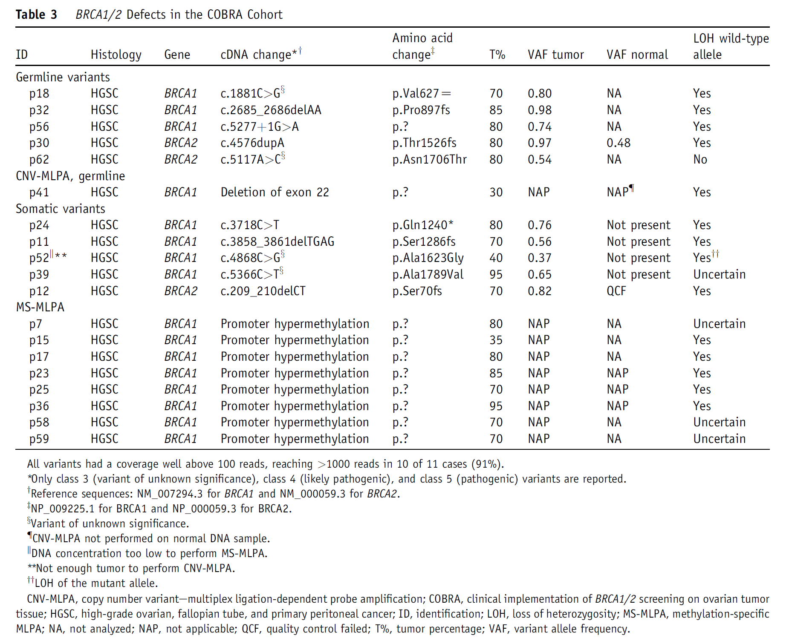

```{r, load_refs, include=FALSE, cache=FALSE}
library(RefManageR)
BibOptions(check.entries = FALSE,
           bib.style = "numeric",
           cite.style = "numeric",
           hyperlink = FALSE,
           dashed = FALSE,
           first.inits = TRUE,
           no.print.fields = c("doi", "url", "isbn", "urldate"))
ACMG <- ReadBib("./ACMG.bib", check = FALSE)
```

```{r setup, include=FALSE}
knitr::opts_chunk$set(echo = FALSE)
```

# Question 1

> Can we determine whether the variant is germline or somatic using allele frequency and tumor percentage in tumor only test?

---
# BRCA result

* BRCA1 mutation: Positive - p.Glu649Ter (c.1945G>T)  
* Variant allele frequency 63.84%  
* Tumor cell percentage: 70%  
* BRCA negative in blood sample

---
# Question 2

> Is it possible **64% allele frequency** of somatic mutation?

---
class: center
# Variant allele frequency in clinical tumor sample

$$Allele \space frequency \approx Read \space count$$
  

---
class: center
# Somatic variant, Two copy, Tumor cellularity 50%

  
Variant allele frequency?

---
class: center
# Germline variant, Heterozigosity, Two copy, Tumor cellularity 25%

  
Variant allele frequency?

class: center
# Germline variant, Heterozigosity, Two copy, Tumor cellularity 50%

  
Variant allele frequency?

---
# Hypothesis

Germline, homo | Germline, hetero | Somatic
:-----: | :----: | :----------------------:
 100% |  50% |  half of tumor cellularity, $\le 50\%$

---
class: center
# Germline variant, Heterozigosity, One copy, LOH, Tumor cellularity 50%

  
Variant allele frequency?

---
class: center
# Germline variant, Heterozigosity, One copy, LOH, Tumor cellularity 25%

  
Variant allele frequency?

---
class: center
# Somatic variant, One copy, LOH, Tumor cellularity 50%

  
Variant allele frequency?

---
class: center
# Somatic variant, Amplification, Tumor cellularity 25%

  
Variant allele frequency?


---
# Variant allele frequency in clinical tumor sample

* Germline vs somatic  
* Tumor cell proportion  
* Loss of heterozygosity 
* Copy number  

---
# Allele frequency in Somatic vs Germline in tumor only sample

* BRCA1 mutation: Positive - p.Glu649Ter (c.1945G>T)  
* Variant allele frequency 63.84%  
* Tumor cell percentage: 70%  

---
# Allele frequency`r Citep(ACMG, "sun_2018_computational_ploscomputationalbiology")`

$AF_{germline}$ $=$ ${pV+1-p} \over {pC+2(1-p)}$  
$AF_{somatic}$ $=$ $pV \over pC+2(1-p)$ 

* Given copy number (C)
* Variant allele count (V)
* Sample purity (p)
* Variant status (somatic or germline)

---
# Limited information

What we know | What we don't know
:-------------:|:-----------------:
Tumor cell percentage | Copy number
Variant allele frequency  | LOH

---
# Error

* Tumor cell percentage
* Allele frequency  

$$Allele \space frequency \not\approx Read \space count$$

---
# BRCA mutation and LOH `r Citep(ACMG, "dejonge_2018_validation_thejournalofmoleculardiagnostics")`



---
# Allele frequency 

* BRCA1 mutation: Positive - p.Glu649Ter (c.1945G>T)  
* Variant allele frequency 63.84%  
* Tumor cell percentage: 70% -> 80%  
* Somatic (supposed)  
* LOH (supposed)  
* One copy (supposed)  

---
class: center
# Allele frequency 


$AF_{somatic}$ $=$ $pV \over pC+2(1-p)$ $= 0.67$
```{r, results='hide'}
(0.8*1)/(0.8*1 + 2*(1-0.8))
```
         
---
# Allele frequency 

* BRCA1 mutation: Positive - p.Glu649Ter (c.1945G>T)  
* Variant allele frequency 63.84%  
* Tumor cell percentage: 70% -> 60%  
* Germline (supposed)  
* LOH (supposed)  
* One copy (supposed)  

---
class: center
# Allele frequency 


$AF_{germline}$ $=$ ${pV+1-p} \over {pC+2(1-p)}$ $= 0.71$
```{r, results='hide', echo=FALSE}
(0.6*1+1-0.6)/(0.6*1 + 2*(1-0.6))
```

---
# Someone ask ...

>Does tumor only NGS test distinguish a variant somatic and germline?  
Answer 'No'  

>Is it possible **64% allele frequency** of somatic BRCA variant?  
Answer 'Yes, It is when BRCA somatic variant accompanied with LOH'  

---
class: center
# Germline variant, One copy, LOH, Tumor cellularity 100% (Bonus1)

Allele frequency 100% **hetero germline** variant  

  

---
class: center
# Somatic variant, Amplification, Hetero, Tumor cellularity 100% (Bonus2)

Allele frequency 90% **somatic** variant  

  

---
class: my-one-page-font
# References

```{r refs, echo=FALSE, results="asis"}
PrintBibliography(ACMG)
```

<style type="text/css">
.remark-slide-content {
    font-size: 32px;
    padding: 1em 4em 1em 4em;
}

.my-one-page-font {
  font-size: 18px;
}

.beginners{
visibility: hidden;
}

.intermediate{
visibility: hidden;
}

.advanced{
visibility: visible;
}
 {
    max-width: 100%;
}
</style>