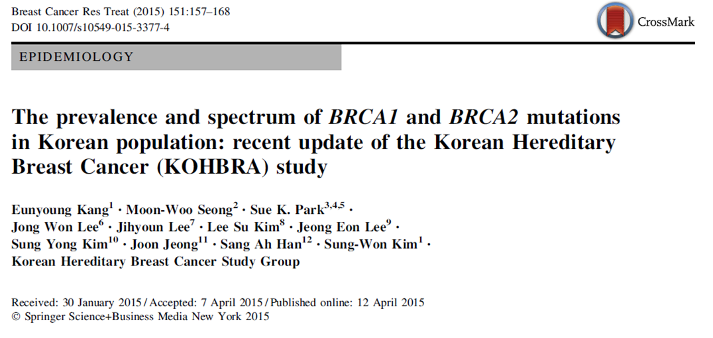
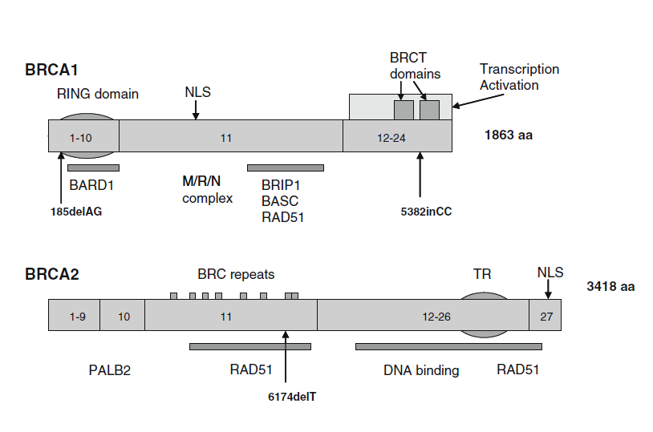

```{r setup, include=FALSE}
options(htmltools.dir.version = FALSE)
knitr::opts_chunk$set(
  #fig.width=9, fig.height=3.5, fig.retina=3,
  out.width = "100%",
  cache = FALSE,
  echo = TRUE,
  message = FALSE, 
  warning = FALSE,
  hiline = TRUE
)
```

```{r xaringan-themer, include=FALSE, warning=FALSE}
library(xaringanthemer)
style_duo_accent(
  primary_color = "#1381B0",
  secondary_color = "#FF961C",
  inverse_header_color = "#FFFFFF",
  text_font_family =  "Noto Sans Korean",
  header_font_family = "Noto Sans Korean"
)
```

```{r, load_refs, include=FALSE, cache=FALSE}
library(RefManageR)
BibOptions(check.entries = FALSE,
           bib.style = "numeric",
           cite.style = "numeric",
           hyperlink = FALSE,
           dashed = FALSE,
           first.inits = TRUE,
           no.print.fields = c("doi", "url", "isbn", "urldate"))
ACMG <- ReadBib("./ACMG.bib", check = FALSE)
```

# Contents

* Allele frequency
* Variant pathogenecity

???
* 발견된 변이에 대한 평가를 하고 보고서에 변이에 대한 임상적 의미를 기록하게 됩니다.
* 변이에 대한 종합적 판단을 위해서는 Bioinformatics에 대한 이해가 필요한 부분이 있습니다.
* NGS 결과를 받아보면 variant 정보가 많이 있습니다. 
* 임상적 상황과 맞추다 보면 발견된 variant에 대한 질문도 많다.

* 질문에 답할 때 allele frequency 가 참고 되는 경우가 많이 있습니다. 
* 예를 들면
  + Somatic vs germline
  + False positive
  + Allele specific copy number (LOH)
* 이번 시간에는 첫번째로 Allele frequency가 어떻게 나오게 되는지 이해하고자 합니다.

* Pathogenecity
  + not all variants has same effect
  + benign vs pathogenic
  + not all variant pathogenecity stratiforword
  
* 두 번째로는 tumor suppressor gene의 변이는 유전자 기능이상을 발생하는지 확인이 필요합니다. 
* 유전자 기능 변화가 변이 별로 다르기 때문에 어떠한 기준으로  변이의 병원성 여부를 확인하는 지 알아보고자 합니다. 

---
### Questions

* Somatic vs germline
* False positive or false negative (cut-off)
* Driver vs passenger (ultra-hypermutation, POLE)
* Tier

???
* 발견된 변이들을 보게 되면 다음과 같은 질문들을 하게 됩니다. 
* 이 경우 allele freqency를 먼저 확인해 보면 판단에 도움이 됩니다.

---
## Allele frequency

* BRCA1 mutation: Positive - p.Glu649Ter (c.1945G>T)  
* Variant allele frequency 63.84%  
* Tumor cell percentage: 70%  
* BRCA negative in blood sample

???
 
난소암 환자에서 BRCA1 변이이고 stop codon을 만드는 nonsense variant입니다. nonsense variant이기 때문에 pathogenic varaint로 생각됩니다. 
변이 allele frequency는 63%이고 병리의사가 측정한 종양세포 비율은 70%입니다. 
환자는 혈액 BRCA 검사에서 음성이기 때문에 종양검체에서 시행한 NGS에서 발견된 이 변이는 germline이 아니라 somatic으로 생각됩니다. 
실제로 임상 선생님으로부터 이 변이에 대한 문의를 받았습니다.

---
### Questions
> Is it possible **64% allele frequency** of somatic mutation?

???
질문은 allele frequency가 63%로 50%에 가까운데 somatic varaint일 수 있느냐라는 것입니다. 

---
### Questions

> Can we determine whether the variant is germline or somatic using allele frequency and tumor percentage in tumor only test?

???
질문을 바꿔보면 allele freqeuncy로 tumor only NGS 검사에서 germline과 somatic을 구분할 수 있느냐 입니다.  

---
class: center
# Variant allele frequency in clinical tumor sample

$$Allele \space frequency \approx Read \space count \space proportion$$
???
variant allele frequency는 무엇일까요?


---
class: center, middle
  

---
class: center
### Somatic variant, Two copy, Tumor cellularity 50%

  
Variant allele frequency?

---
class: center

### Germline variant, Heterozigosity, Two copy, Tumor cellularity 25%

  
Variant allele frequency?

---
class: center
### Germline variant, Heterozigosity, Two copy, Tumor cellularity 50%

  
Variant allele frequency?

---
# Proposition

Germline, homo | Germline, hetero | Somatic
:-----: | :----: | :----------------------:
 100% |  50% |  half of tumor cellularity, $\le 50\%$

---
class: center
### Germline variant, Heterozigosity, One copy, LOH, Tumor cellularity 50%

  
Variant allele frequency?

---
class: center
### Germline variant, Heterozigosity, One copy, LOH, Tumor cellularity 25%

  
Variant allele frequency?

---
class: center
### Somatic variant, One copy, LOH, Tumor cellularity 50%

  
Variant allele frequency?

---
class: center
### Somatic variant, Amplification, Tumor cellularity 25%

  
Variant allele frequency?


---
# Variant allele frequency in clinical tumor sample

* Germline vs somatic  
* Tumor cell proportion  
* Loss of heterozygosity 
* Copy number  

---
# Allele frequency in Somatic vs Germline in tumor only sample

* BRCA1 mutation: Positive - p.Glu649Ter (c.1945G>T)  
* Variant allele frequency 63.84%  
* Tumor cell percentage: 70%  

---
# Allele frequency fomulas `r Citep(ACMG, "sun_2018_computational_ploscomputationalbiology")`

$AF_{germline}$ $=$ ${pV+1-p} \over {pC+2(1-p)}$  
$AF_{somatic}$ $=$ $pV \over pC+2(1-p)$ 

* Given copy number (C)
* Variant allele count (V)
* Sample purity (p)
* Variant status (somatic or germline)

---
# Limited information

What we know | What we don't know
:-------------:|:-----------------:
Tumor cell percentage | Copy number
Variant allele frequency  | LOH

---
# Allele frequency 

* BRCA1 mutation: Positive - p.Glu649Ter (c.1945G>T)  
* Variant allele frequency 63.84%  
* Tumor cell percentage: 70% -> 80%  
* Somatic (supposed)  
* LOH (supposed)  
* One copy (supposed)  

---
class: center
## Allele frequency 


$AF_{somatic}$ $=$ $pV \over pC+2(1-p)$ $= 0.67$

```{r, results='hide', echo=FALSE}
(0.8*1)/(0.8*1 + 2*(1-0.8))
```
         
---
# Allele frequency 

* BRCA1 mutation: Positive - p.Glu649Ter (c.1945G>T)  
* Variant allele frequency 63.84%  
* Tumor cell percentage: 70% -> 60%  
* Germline (supposed)  
* LOH (supposed)  
* One copy (supposed)  

---
class: center
## Allele frequency 


$AF_{germline}$ $=$ ${pV+1-p} \over {pC+2(1-p)}$ $= 0.71$
```{r, results='hide', echo=FALSE}
(0.6*1+1-0.6)/(0.6*1 + 2*(1-0.6))
```

---
#  Strand bias

$$Allele \space frequency \not\approx Read \space count \space proportion$$

---
# Variant pathogenecity

---
# Question  
* 76/M, Lung adenocarcinoma  
* NM_000059.3(BRCA2):c.5683G>A (p.Glu1895Lys)

---
class: my-one-page-font

>This sequence change replaces glutamic acid with lysine at codon 1895 of the BRCA2 protein (p.Glu1895Lys). The glutamic acid residue is weakly conserved and there is a small physicochemical difference between glutamic acid and lysine. This variant is present in population databases (rs146351301, ExAC 0.009%). This variant has been reported in individuals affected with breast cancer (PMID: 25682074, 20104584, 27257965, 28664449). In the literature, this variant is also known as 5911G>A. ClinVar contains an entry for this variant (Variation ID: 142307). Algorithms developed to predict the effect of missense changes on protein structure and function output the following: SIFT: "Tolerated"; PolyPhen-2: "Benign"; Align-GVGD: "Class C0". The lysine amino acid residue is found in multiple mammalian species, suggesting that this missense change does not adversely affect protein function. These predictions have not been confirmed by published functional studies and their clinical significance is uncertain. In summary, the available evidence is currently insufficient to determine the role of this variant in disease. Therefore, it has been classified as a Variant of Uncertain Significance.

`r tufte::quote_footer('Sherloc Invitae')`

---

```{r ionTorrent, eval=TRUE, echo=FALSE}
library(tidyverse)
brcaIT <- readr::read_csv("brcaIonTorrent.csv", col_names = FALSE)

brcaIT %>%
  rename(Name = X1, Value = X2) %>%
  filter(Value != "NA") %>%
  DT::datatable(options=list(autoWidth = FALSE,
                pageLength = 8,
                searching = FALSE,
                scrollX = TRUE),
                fillContainer = FALSE)

```
---
## Standards and Guidelines for the Interpretation of Sequence Variants

* To describe variants identified in Mendelian disorders  
* American College of Medical Genetics and Genomics (ACMG) `r Citep(ACMG, "richards_2015_standards_genetmeda")`  
* ENIGMA BRCA1/2 Gene Variant Classification Criteria  
* International Agency for Research on Cancer (IARC)  

---
# Categories of interpretation of variants

* Pathogenic  
* Likely-pathogenic  
* Uncertain (VUS)  
* Likely-benign  
* Benign  

---
# Let's guess the evidences  

---
# Famly pedigree


---
# Segregation data (BS1, PP1)  

* Caveat: linkage disequilibrium  
* Penetration rate  
* Difficult statistical evaluation  

---
# Population data


---
# Population data  

* 5%: benign stand alone (BA1)  
* 0.5-5% (BS1)  
* The first time observed variant! (Absent in population DB, PM2)  

---
# Null variant  

* Frameshift, Nonsense, canonical +-1 or 2 splicing site, initiation codon
* Caveat: LOF variants at the extreme 3′ end of a gene  
* Caveat: presence of multiple transcripts  

---
# Computational (in silico) data  

* PolyPhen2, SIFT, MutationTaster, etc  
* Mutational hot spot and/or critical and wellestablished (PM1)  
* Protein length changes due to in-frame deletions/insertions and stop losses functional domain (PM4 BP3)  
* Novel missense at the same position (PM5)

---
# Other evidence  

* de novo variants (PS2 PM6)
* Functional studies (PS3 BS3)
* Allelic data (BP2 PM3)  

---
# Evidences of interpretation

* Population data  
* Computational data  
* Functional data  
* Segregation data  
* De novo data  
* Allele data  
* Other databases  
* Other data  

---
##### 27 variant attributes


---
class: small-font
# Characteristics of BRCA1/2  

* LOF known mechanism of disease (for PVS1)  
* Mode of inheritance (for PM3/BP2)
  * AD/AR (BRCA2)
* Missense pathogenic (for PP2/BP1)  
  * BRCA2 1%  
* Hot spot or critical/well-established functional domain (for PM1)
  * BRCA2, Helical (2479-2667), OB (2670-2799 and 3052-3190), Tower (2831-2872)  

---
class: small-font
## NM_000059.3(BRCA2):c.5683G>A (p.Glu1895Lys)

* LOF known mechanism of disease (for PVS1)  
* Mode of inheritance (for PM3/BP2)
  * AD/AR (BRCA2)
* Missense pathogenic (for PP2/**BP1**)  
  * **BRCA2 1%**  
* Hot spot or critical/well-established functional domain (for PM1)
  * BRCA2, Helical (2479-2667), OB (2670-2799 and 3052-3190), Tower (2831-2872)  

---
### Characteristics of varant (NM_000059.3(BRCA2):c.5683G>A (p.Glu1895Lys))  

* ClinVar (Uncertain significance (Last evaluated: Nov 1, 2015)) (PP5, BP6)
* Population AF: $8.29e^{-06}$ (PM2, BA1, BS1)
* Insilico SIFT 1.0, phyloP -0.72, PolyPhen-2 0.004 **BP4**  

---
# Functional assay (BS3)

* Findlay (2018) Nature 562: 217 PubMed: 30209399
* Guidugli (2013) Cancer Res 73: 265 PubMed: 23108138  
* Biswas (2011) Blood 118: 2430 PubMed: 21719596  
* Becker (2012) Breast Cancer Res Treat 135: 167 PubMed: 22729890   

---
class: my-one-page-font

>This sequence change replaces glutamic acid with lysine at codon 1895 of the BRCA2 protein (p.Glu1895Lys). The glutamic acid residue is weakly conserved and there is a small physicochemical difference between glutamic acid and lysine. This variant is present in population databases (rs146351301, ExAC 0.009%). This variant has been reported in individuals affected with breast cancer (PMID: 25682074, 20104584, 27257965, 28664449). In the literature, this variant is also known as 5911G>A. ClinVar contains an entry for this variant (Variation ID: 142307). Algorithms developed to predict the effect of missense changes on protein structure and function output the following: SIFT: "Tolerated"; PolyPhen-2: "Benign"; Align-GVGD: "Class C0". The lysine amino acid residue is found in multiple mammalian species, suggesting that this missense change does not adversely affect protein function. These predictions have not been confirmed by published functional studies and their clinical significance is uncertain. In summary, the available evidence is currently insufficient to determine the role of this variant in disease. Therefore, it has been classified as a Variant of Uncertain Significance.

`r tufte::quote_footer('Sherloc Invitae')`

---
# BRCA2 c.10150C>T p.Arf3384Ter

---
## KOBRA `r Citep(ACMG, "kang_2015_prevalence_breastcancerrestreat")`




---
## End truncation


---
# HUMAN MUTATION Mutation in Brief 31: E 1200-E1240 (2010) Online

Finally, three sequence variants – BRCA2 c.9976A>T (BIC: K3326X), c.10095delCins11 (BIC: 10323delCins11) and c.10150C>T (BIC: **R3384X**) predicted to result in protein truncation were ruled as exceptions that **could not be classified** because of their **location near the 3´-end** and possibly dispensable part of the gene.

---
# Clinvar

BRCA2 c.9976A>T (p.Lys3326*) variant, located upstream of this variant and also in the last exon of the gene, is a known benign variant.

---
# Conclusions
* Allele frequency
* ACMG guideline  

---
class: my-one-page-font
# References

```{r refs, echo=FALSE, results="asis"}
PrintBibliography(ACMG)
```

<style type="text/css">
.remark-slide-content {
    font-size: 24px;
    padding: 1em 4em 1em 4em;
}

.my-one-page-font {
  font-size: 18px;
}

.beginners{
visibility: hidden;
}

.intermediate{
visibility: hidden;
}

.advanced{
visibility: visible;
}
 {
    max-width: 100%;
}
</style>